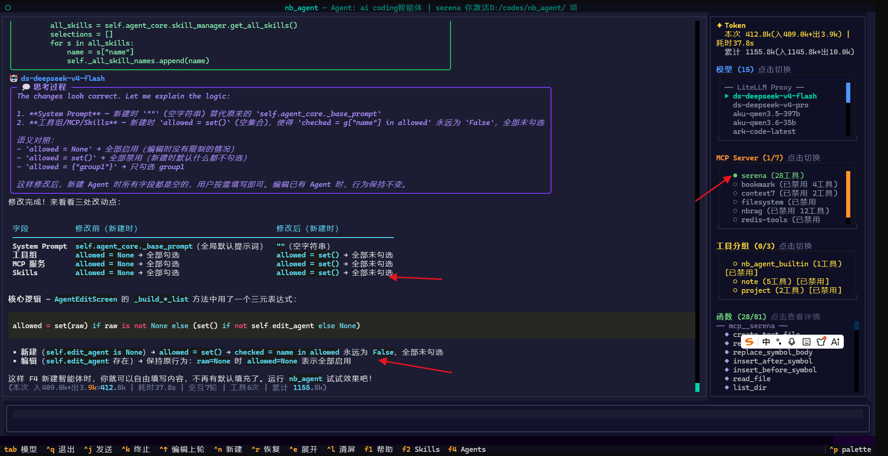
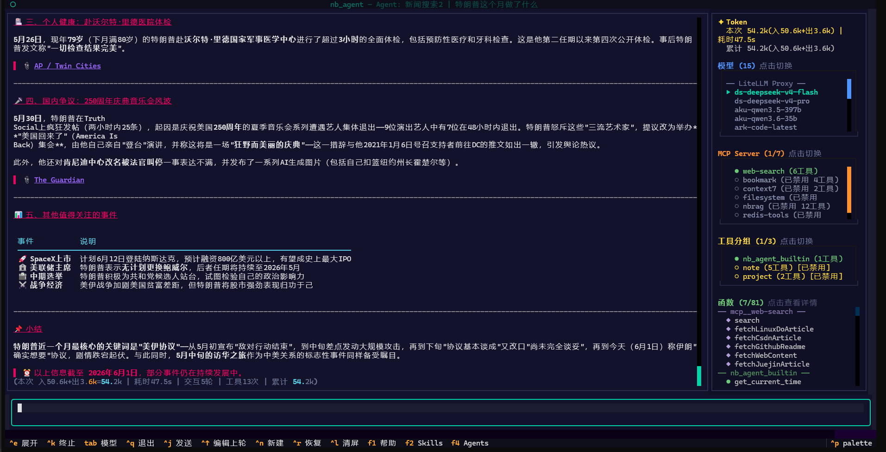

# nb_agent

nb_agent 是一个用户能基于此快速开发agent应用的框架，能快速扩展tools mcp skills，创建agents，自带tui终端。

**手写 ReAct Agent 框架 + 赛博朋克 TUI** — 不依赖 LangChain，用纯 Python 实现 LLM ↔ Tool 循环。

nb_agent tui截图：
截图是nb-agent接入serena这个mcp，变身为ai coding工具。
自己吃自己的狗粮：自己打造nb-agent的终端 + ai coding智能体，使用deepseek-v4-flash 模型，修改nb-agent项目自身的源码，验证效果完美，一次即可改对代码。


截图是nb-agent创建的新闻agent，通过接入了open web search 这个mcp，用于搜索互联网娱乐八卦新闻：
在tui终端提问:特朗普这个月做了什么呀？效果如下图


## 特性

- **手写 ReAct 循环**：LLM → tool_calls → execute → feedback，无框架黑魔法
- **三种扩展方式**：Tools（Python 函数）+ MCP（外部工具协议）+ Skills（Markdown 指导手册）
- **Agent 配置**：创建多个 Agent 预设，每个可独立配置 system prompt、工具组、MCP Server、Skills 的启用范围
- **MCP 多 Server 管理**：stdio / SSE / HTTP 三种传输方式，运行时启禁，工具命名空间防冲突
- **生产级特性**：上下文裁剪、指数退避重试、危险操作审批、SQLite 会话持久化
- **赛博朋克 TUI**：流式输出 + 思考链 + 模型切换 + Token 统计 + 右侧工具面板

## 快速开始

```bash
pip install very_nb_agent   # 这里要注意是very_nb_agent，不是nb_agent，因为nb_agent 和别人的已有 nbagent名字太相似，被pypi拒绝了。
```

或者在你的项目中集成：

```python
import tools                          # 导入即注册你的自定义工具
from nb_agent import load_config, AgentApp

config = load_config()
app = AgentApp(config)
app.run()
```

## 配置

复制 `config.example.jsonc` 到工作目录，重命名为 `config.jsonc`：

```bash
cp config.example.jsonc config.jsonc
# 编辑 config.jsonc，填入你的 API Key
nb_agent
```

配置优先级：`CLI 参数 > 环境变量 > 项目级 ./config.jsonc > 全局 ~/.nb_agent/config.jsonc > 默认值`

API Key 支持 `{env:DEEPSEEK_API_KEY}` 语法从环境变量读取。

**raw_model** — 当配置的模型 key 与 API 实际要求的模型名不一致时，可通过 `raw_model` 指定真实模型名：

```jsonc
"models": {
    "ds-deepseek-v4-flash-200k": {
        "name": "DeepSeek V4 Flash (官方直连)",
        "raw_model": "deepseek-chat",
        "limit": { "context": 200000, "output": 64000 }
    }
}
```

若未设置 `raw_model`，则直接使用 key（如 `ds-deepseek-v4-flash-200k`）作为模型名请求接口。

## 三种扩展方式

### 1. Tools — Python 函数工具

用 `@tool` 装饰器 + Pydantic 参数模型，导入即自动注册：

```python
from nb_agent.tools import tool
from pydantic import BaseModel, Field

class SearchParams(BaseModel):
    query: str = Field(description="搜索关键词")

@tool(group="search")  # group 可选，用于分组管理
def web_search(params: SearchParams) -> str:
    """搜索互联网，返回相关结果"""
    # ... 你的逻辑
    return "搜索结果"
```

工具名自动生成为 `{group}__{函数名}`（如 `search__web_search`），无 group 时直接用函数名。

### 2. MCP — 外部工具协议

在 `config.jsonc` 中配置 MCP Server：

```jsonc
"mcp": {
    // 本地 stdio 方式启动自定义 MCP Server（FastMCP 编写）
    "bookmark": {
        "type": "local",
        "command": ["python", "mcp_servers/bookmark_server.py"],
        "enabled": true
    },
    // SSE 方式连接远程 MCP Server
    "web-search": {
        "type": "sse",
        "url": "http://localhost:3000/sse",
        "enabled": true
    },
    // HTTP 方式连接远程 MCP Server（streamableHttp 协议，http 是别名）
    "nbrag": {
        "type": "http",
        "url": "http://localhost:9101/mcp"
    }
}
```

支持四种传输方式：

| type | 说明 |
|------|------|
| `local`（默认） | stdio 子进程，配置 `command` + `args` |
| `sse` | SSE 协议远程连接，配置 `url` |
| `streamableHttp` | Streamable HTTP 远程连接，配置 `url` |
| `http` | `streamableHttp` 的别名，方便记忆 |

不传 `type` 默认走 `local`（stdio）。MCP 工具名自动加 `mcp__{server}__{tool}` 前缀。

### 3. Skills — Markdown 指导手册

Skills 教 AI "怎么做"某类任务。不是可执行代码，而是 Markdown 格式的操作指南。

遵循 **[Agent Skills 开放规范](https://agentskills.io)**（Anthropic 创建，Claude / OpenAI Codex / Gemini CLI / Cursor / VS Code 等 26+ 平台采用）。

**渐进式披露（Progressive Disclosure）**：
1. **Discovery** — 启动时 system prompt 只注入 name + description 清单，不浪费 token
2. **Activation** — AI 判断需要某 Skill 时，调用 `view_skill("name")` 加载完整指南
3. **Execution** — 按指南执行任务

**目录扫描**（后者覆盖前者）：

```
内置:     nb_agent/skills/builtin/ (code-review, explain-code, refactor)
全局级:   ~/.nb_agent/skills/my-skill/SKILL.md
跨平台:   ~/.agents/skills/my-skill/SKILL.md     ← 与 Codex/Gemini CLI 共享
项目级:   .nb_agent/skills/my-skill/SKILL.md
跨平台:   .agents/skills/my-skill/SKILL.md        ← 与 Codex/Gemini CLI 共享
```

**SKILL.md 格式**：

```markdown
---
name: deploy-checklist
description: >-
  部署前检查清单。当用户提到部署、发布、上线时使用。
---

# 部署检查

## 检查项
1. 所有测试通过
2. 环境变量已配置
3. 数据库迁移已执行
...
```

> 文件夹名必须与 `name` 字段一致。完整的 frontmatter 字段说明见 [agentskills.io/specification](https://agentskills.io/specification)。

## Agent 管理

Agent 是一组 "system prompt + 工具/MCP/Skills 启用范围" 的配置预设。通过 TUI 中的 **F4** 快捷键管理：

- **新建 Agent**：为不同任务创建专用预设（如 "代码审查专家"、"翻译助手"）
- **勾选控制**：每个 Agent 可独立选择启用哪些工具组、MCP Server、Skills
- **切换应用**：随时切换当前使用的 Agent，自动重置会话

启用范围采用三值语义：
- 不设置 → 全部允许（默认）
- 选择部分 → 只允许选中的
- 全部取消 → 全部禁用

## 审批引擎

可插拔的工具审批机制，防止 AI 执行危险操作：

```jsonc
// config.jsonc
{
  "approval": {
    "dangerous_tools": ["note__delete_note"],
    "auto_approve": false
  }
}
```

也可用代码注入自定义规则：

```python
def rule_redis_write(tool_name: str, tool_kwargs: dict) -> bool:
    """Redis 写命令弹窗确认，只读命令直接放行"""
    if tool_name != "mcp__redis-tools__redis_execute":
        return False
    cmd = tool_kwargs.get("command", "").strip().split()
    return cmd[0].upper() in {"SET", "DEL", "HSET"} if cmd else False

app.agent.approval_engine.add_rule(rule_redis_write)
```

## nb_log 配置

nb_agent 使用 [nb_log](https://github.com/ydf0509/nb_log) 作为日志库。TUI 模式下需要在项目根目录的 `nb_log_config.py` 中设置以下 3 项，否则 **TUI 会黑屏**：

```python
PRINT_WRTIE_FILE_NAME = None   # 禁止 nb_log 劫持 sys.stdout
SYS_STD_FILE_NAME = None       # 禁止 nb_log 劫持 sys.stdout
AUTO_PATCH_PRINT = False       # 禁止 monkey patch print
```

> Textual TUI 独占终端的 alternate screen buffer 渲染，上述三项配置会破坏渲染通道。

## CLI

```bash
nb_agent                              # 启动 TUI
nb_agent --config ./my_config.jsonc   # 指定配置
nb_agent run "帮我分析代码性能"        # 非交互模式
nb_agent sessions list                # 查看历史会话
```


## Agent 管理功能

支持创建多个 **Agent 预设**，每个 Agent 是独立的一套配置组合（System Prompt + 工具组开关 + MCP 开关 + Skills 开关 + 默认模型），让 AI 在不同场景下拥有不同的身份和能力边界。按 **F4** 管理。
从不同的agent创建会话，适应不同的场景。
例如你可以通过接入serena mcp后，专门创建一个agent，用于ai coding。
通过接入 web search mcp后，专门创建一个agent，用于搜索互联网娱乐八卦新闻。
通过接入 nbrag mcp后，专门创建一个agent，用于rag知识库检索。
不同的agent绑定不同的System Prompt + 工具组开关 + MCP 开关 + Skills 开关，可以减少无关工具暴露给ai，节约很多tokens，提高ai的决策效率。

## TUI 快捷键

| 快捷键 | 功能 |
|--------|------|
| Ctrl+J / Ctrl+Enter | 发送消息 |
| Enter | 输入框内换行 |
| Tab | 切换模型 |
| Ctrl+N | 新建会话 |
| Ctrl+R | 恢复历史会话 |
| Ctrl+K | 终止 AI 回答 |
| Ctrl+↑ | 编辑上一轮提问 |
| Ctrl+E | 展开/收起输入框 |
| Ctrl+L | 清空屏幕 |
| Ctrl+P | 命令面板 |
| F1 | 帮助 |
| F2 | Skills 列表（查看/应用） |
| F4 | Agent 管理（创建/编辑/切换） |
| Ctrl+Q | 退出 |

## 架构总览

```
用户输入 → AgentCore (ReAct Loop, max 30 轮)
             ├── Tools (@tool 装饰器注册的 Python 函数)
             ├── MCP Server (外部进程，stdio/SSE/HTTP)
             ├── Skills (view_skill → SKILL.md 指导手册)
             └── ApprovalEngine (危险操作审批)
                    ↕
              LLM API (OpenAI 兼容，按 provider 分组)
                    ↕
              流式/非流式回复 → TUI 渲染
                    ↕
              SessionStore (SQLite 会话持久化)
```

**三种扩展方式完全正交**：
- **Tools** = 可执行的 Python 函数
- **MCP** = 外部进程提供的工具（通过 stdio/SSE/HTTP 通信）
- **Skills** = Markdown 格式的指导手册（渐进式披露，省 token）

## 项目结构

```
nb_agent/
├── config/          — 配置加载 (JSONC + 环境变量)
├── core/            — ReAct 核心
│   ├── agent.py     — AgentCore 核心类
│   ├── models.py    — ModelInfo, AgentResponse 等
│   ├── context.py   — Token 估算 & 上下文裁剪
│   └── retry.py     — 指数退避重试
├── tools/           — @tool 装饰器 + 内置工具
├── mcp/             — MCP 多 Server 管理
├── skills/          — Skills 渐进式披露系统
│   ├── manager.py   — SkillManager
│   └── builtin/     — 内置 Skills (code-review, explain-code, refactor)
├── session/         — SQLModel 会话 + Agent 配置持久化
├── approval/        — 可插拔工具审批引擎
├── tui/             — Textual 赛博朋克 TUI
│   ├── app.py       — AgentApp 主类
│   ├── styles.tcss  — 样式
│   └── widgets/     — UI 组件 (输入框、工具面板、弹窗、命令面板)
└── utils/           — 日志工具
```

## 问答章节

### 1. 什么是nb_agent

ReAct Agent 框架 + 赛博朋克 TUI。不依赖 LangChain，纯 Python 实现 LLM ↔ Tool 循环，支持三种扩展方式：Python 函数工具（@tool 装饰器）、MCP 外部工具协议、Skills Markdown 指导手册(严格按照agentskills.io 规范)。`pip install very_nb_agent` 一条命令就能跑。

### 2. 用 nb_agent 有什么好处

- **零框架依赖**：没有 LangChain 黑魔法，ReAct 循环完全手写，行为可控、调试透明
- **三种正交扩展**：Tools（写代码）、MCP（接外部工具）、Skills（写 Markdown 指南），各司其职
- **生产级特性**：上下文裁剪、指数退避重试、危险操作审批引擎、SqlModel 会话持久化
- **TUI 开箱即用**：流式输出 + 思考链可视 + 模型热切换 + Token 统计 
- tool  mcp  skills 热启用(无需改配置文件或代码)
- 多agents管理(每个agent独立配置 提示词+ 工具组+ MCP Server+ Skills ，快速从不同的agent创建会话应对不同的场景)
- **接入门槛极低**：`pip install very_nb_agent && nb_agent` 即可，集成到项目只需几行代码

### 3 nb_agent 能不能作为编程助手呀？（类似claude-code opencode cline 这种终端工具）

**能。** 通过接入第三方编程 MCP，nb_agent 可以化身为终端编程助手。

**Serena** — 当前最流行的开源编程 MCP。接入后用户不需要写任何 tools 函数、不需要写任何 skills、不需要再接 filesystem / codegraph 等杂七杂八的 MCP，零代码即可让 nb_agent 拥有类似 opencode / cline / claude-code 的编程能力。

**nbrag / context7** — 文档与代码知识库 MCP，可把任意第三方框架的最新教程和源码向量化，编程时精确查找 API 用法。

在 `config.jsonc` 的 `mcp` 节配置即可：

```jsonc
"mcp": {
    // Serena（语义级编程 MCP：代码索引、符号导航、跨文件重构、智能编辑）
    // 安装: uv tool install -p 3.12 serena-agent@latest --prerelease=allow
    "serena": {
        "type": "local",
        "command": ["serena", "start-mcp-server", "--project", "D:/codes/my_project"],
        "enabled": true
    },
    // nbrag（Agentic RAG MCP：文档/代码向量化导入、多轮智能检索）
    // 安装: uv tool install nbrag  或  pip install nbrag
    // 支持 http（单独启动服务）和 local（子进程启动）两种方式
    "nbrag": {
        "type": "http",
        "url": "http://localhost:9101/mcp"
    },
    // context7（实时文档查询 MCP：查任意库的官方文档和代码示例）
    "context7": {
        "type": "local",
        "command": ["npx", "-y", "@upstash/context7-mcp@latest"],
        "enabled": false
    }
}
```

### nb_agent 支不支持 RAG 知识库 呀？

**支持。** nbrag 是一个独立的 Agentic RAG MCP Server（12 个工具），可导入代码、文档等任意文本，尤其对 Python 项目有奇效（AST 自动解析 class/function 作用域）。在 nb_agent 的 config.jsonc 中配置为 MCP Server 即可使用——MCP 暴露了工具描述和入参，AI 直接就能理解怎么用。如果想更进一步，把 `skills/nbrag-workflow/SKILL.md` 复制到 `.nb_agent/skills/nbrag-workflow/SKILL.md`，AI 会按最佳检索策略打组合拳。

nbrag作为知识库，吊打传统native知识库， 所以nb_agent支持mcp，nbrag是rag mcp，所以nb_agent 支持知识库


## License

MIT
